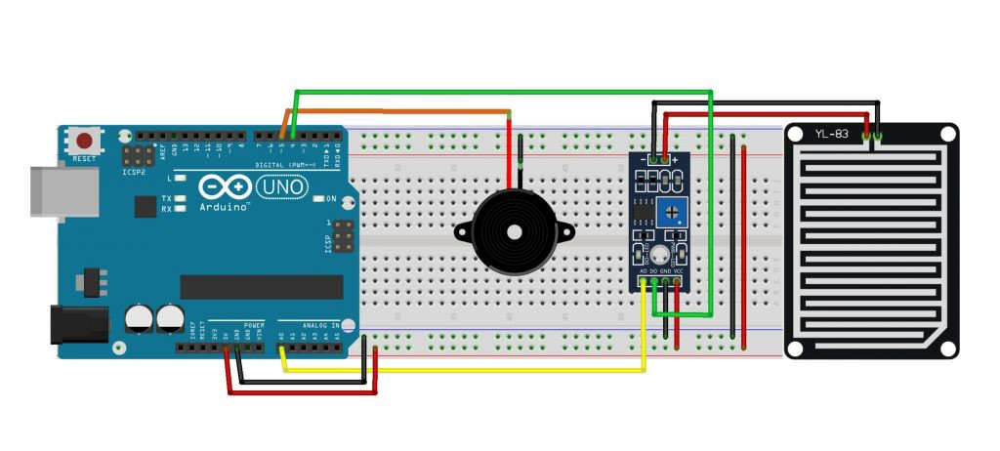

# Rain Detector with Arduino Uno

## Description

- Rain sensor is a sensor that functions to detect whether it is raining or not. The working principle of this sensor module is that when rainwater falls and hits the sensor panel, an electrolysis process will occur with the rainwater. Because rainwater is included in the class of electrolyte liquids, where the liquid will conduct electric current. In this rain sensor there is a comparator IC where the output from this sensor can be in the form of high and low logic (on or off). And in this sensor module there is also an output in the form of voltage. The voltage output can be connected to an Arduino and used to automate clotheslines or rain alarms.

## Circuit Schematic

- Below you can see a schematic image to facilitate the wiring of cables from the microcontroller to devices, both input and output sensors:



## Component (Tools & Materials):

- Arduino Uno = 1 unit;
- Breadboard / ProjectBoard = 1 unit;
- Piezo Buzzer = 1 unit;
- Rain Sensor / Water Sensor (FC-37) = 1 unit;
- Wired;

## Sketch Code Program:

```cpp
/* Program Detektor Hujan */

const int pinBuzzer = 7;
int pinSensor = A1;
int batasNilai = 500;

void setup() {
    Serial.begin(9600);
    pinMode(pinBuzzer, OUTPUT);
}
void loop() {
    int nilai = analogRead(pinSensor);
    Serial.print(nilai);
    if (nilai < batasNilai) {
    digitalWrite(pinBuzzer, HIGH);
    }
    else {
    digitalWrite(pinBuzzer, LOW);
    }
    delay(500);
}

```

## Conclusion:

- If this sensor is exposed to water on the sensor board, its resistance will change. the more water that hits the smaller the resistance and vice versa. In this program, if rain is detected, the buzzer will sound.
